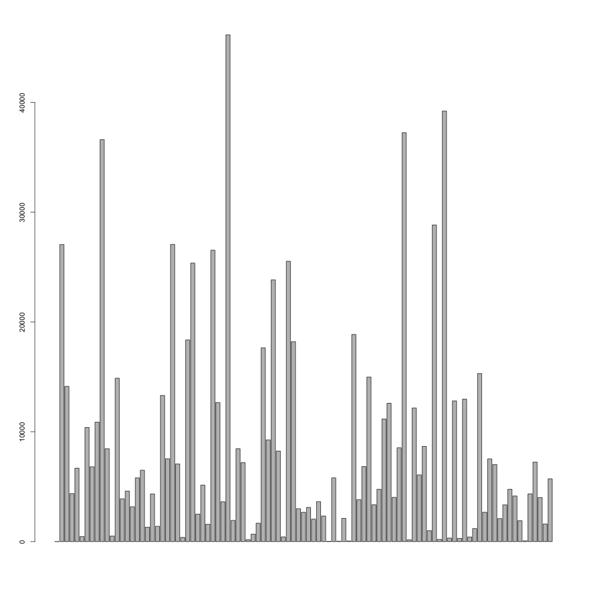
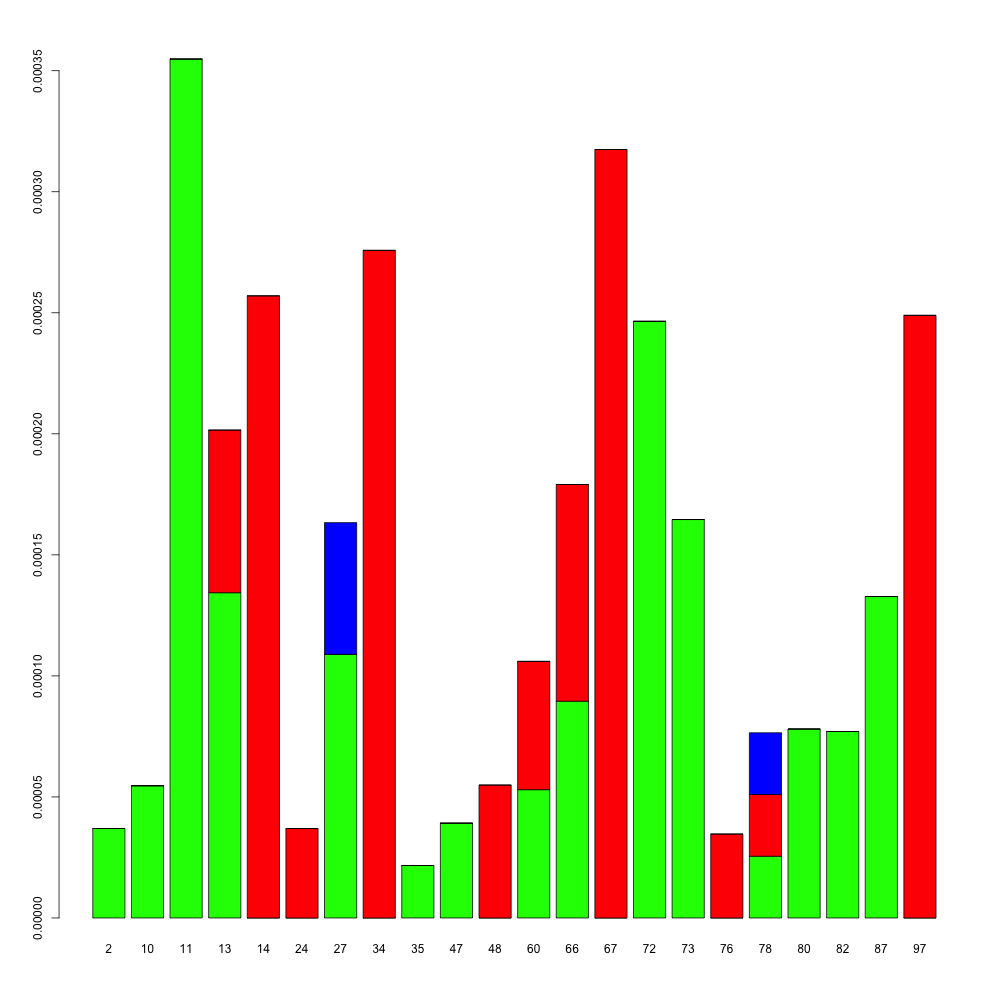
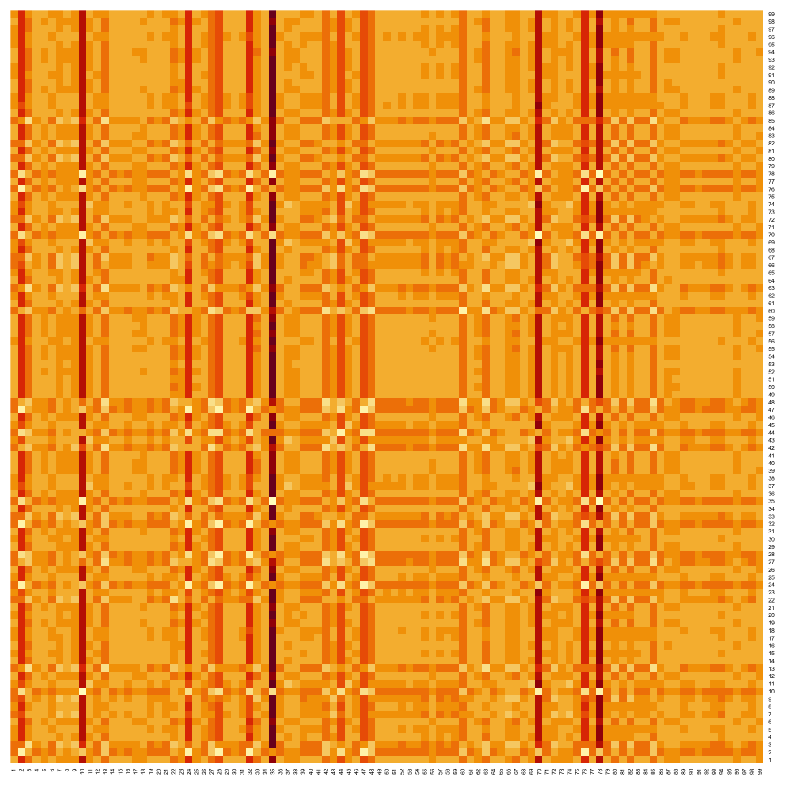
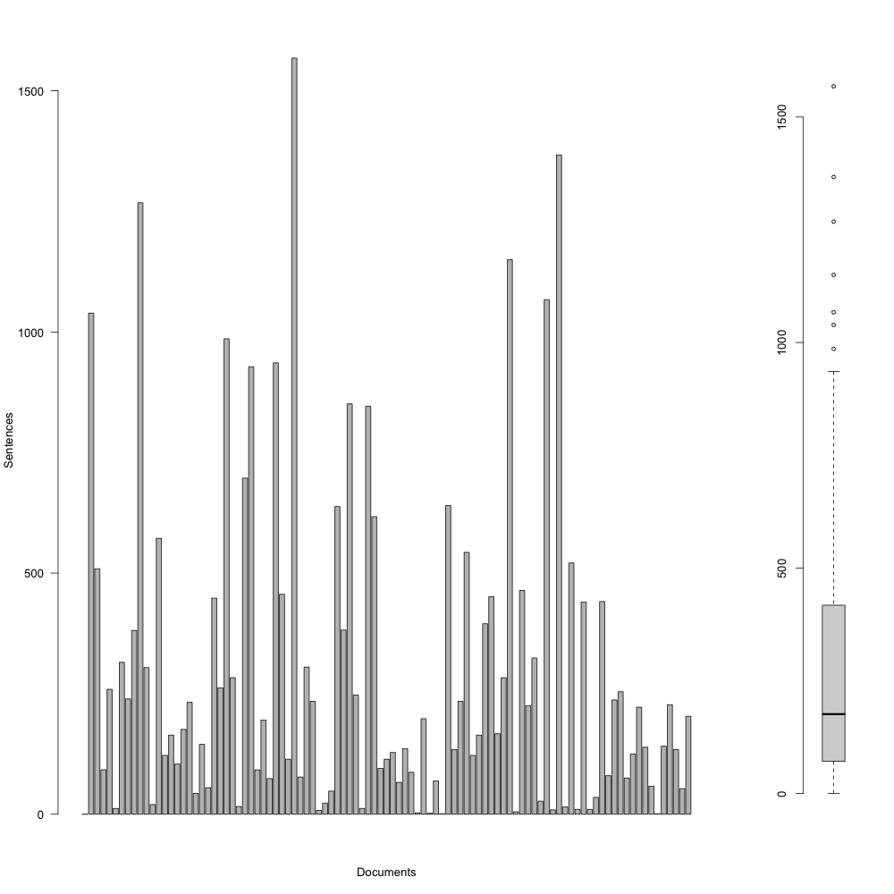

# Exercise 9

**In General**: Please ask questions in the [ilias-Forum](https://www.ilias.uni-koeln.de/ilias/goto_uk_frm_3270419.html) for this course, so that others can also see the question and answer*.

*Please submit your solutions to this exercise until July 10th.*

The goal of this exercise is to get to learn about plotting.

*Note*: There is no automatic testing this week (because it caused more issues than it solved). Instead, the task descriptions below also state expected results for some inputs. Please check that your solution looks similar and ask in the forum if it doesn't.

## Step 1

The relevant reading this week is the slides of the Zoom session, uploaded to ilias.

## Step 2

Clone this repository. The same as last week.

## Step 3
Again (as last week), open the file `R/exercise.R` in your favorite text editor. Depending on your operating system and settings, double clicking may open an editor that came with the R installation. The directory `data` contains a few files we‘ll be using in the exercises.

This week we will add more plots to the corpus visualisation from last week. The file `R/exercise.R` contains code to extract data from the corpus, and store it all in a data.frame. Please examine the code to make sure you understand what's in each column.

- a) Generate a bar plot that shows the number of tokens per document. 

- b) Generate a bar plot that shows the amount of color words in each document as a stacked bar chart (for the colors red, green, blue). You will need to tweak the data input a little bit. Please remove documents that do not have any color word. Obviously, it would be cool to color the areas in the appropriate color. 

- c) The function `dist()` can be used to compute Euclidean and other distances between rows in a table. Please calculate the Manhattan-distance between the documents in the corpus and visualise their similarity in a heatmap. 

- d) It's often useful to visualise a diachronic development as well as a distribution simultaneously. Please generate a plot that shows the number of sentences per document as a bar chart. Next to the bar chart, you should show a box plot that shows the distribution. Make it so that the bar chart is 5 times wider than the box plot. 
- e) If you look closely, you notice that the axes in the plots in d are not aligned. Can you adapt the plot so that they are?

## Step 4
Don't forget to save your file.
Now turning back to git: Add your file to the staging area (`git add R/exercise.R`), commit it (`git commit -m ""`, you need to fill in a commit message), and push it to the server (`git push --set-upstream origin BRANCHNAME`).

